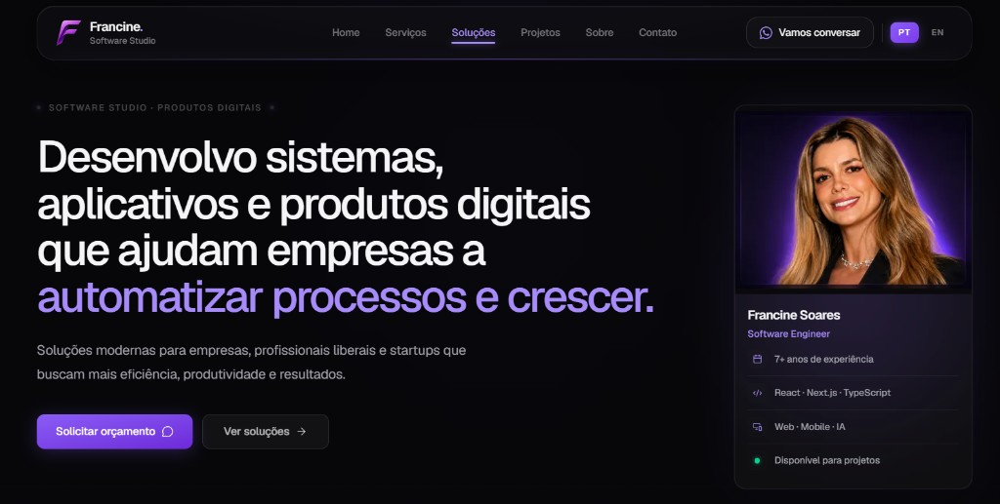

# 🌐 Francine Soares

Meu portfólio profissional desenvolvido com Next.js, onde apresento minha trajetória, projetos, serviços e soluções digitais.

🔗 **Acesse:** https://francinesoares.dev

## Preview



---

## ✨ Sobre o projeto

Este projeto foi desenvolvido para representar minha atuação como **Engenheira de Software** e **Software Studio**, reunindo:

- Apresentação profissional
- Projetos e domínios de atuação
- Serviços oferecidos
- Soluções digitais
- Tech stack completa
- Canais de contato
- Design responsivo e moderno
- Suporte a PT-BR e EN

O objetivo é oferecer uma experiência agradável para recrutadores, empresas e potenciais clientes.

---

## 🚀 Tecnologias

- **Next.js 16** (App Router)
- **React 19**
- **TypeScript**
- **Tailwind CSS v4**
- **Framer Motion**
- **Lucide Icons**
- **shadcn/ui** (Base UI)
- **Vitest**
- **Vercel**

---

## 📦 Executando o projeto

Clone o repositório:

```bash
git clone https://github.com/francinessoares/francine-portfolio.git
```

Entre na pasta:

```bash
cd francine-portfolio
```

Instale as dependências:

```bash
npm install
```

Execute o projeto:

```bash
npm run dev
```

A aplicação estará disponível em:

```
http://localhost:3000
```

### Scripts disponíveis

```bash
npm run dev      # servidor de desenvolvimento
npm run build    # build de produção
npm run start    # servidor de produção
npm run lint     # ESLint
npm run test     # testes de integração
```

### Variáveis de ambiente

Crie um `.env.local` na raiz:

```env
NEXT_PUBLIC_SITE_URL=https://francinesoares.dev
NEXT_PUBLIC_GITHUB_URL=https://github.com/francinessoares
NEXT_PUBLIC_LINKEDIN_URL=https://www.linkedin.com/in/francine-soares-5ba112124/
NEXT_PUBLIC_EMAIL=francinesoares22@gmail.com
NEXT_PUBLIC_WHATSAPP=5548999456066
```

| Variável | Obrigatória | Descrição |
|----------|-------------|-----------|
| `NEXT_PUBLIC_SITE_URL` | Recomendada | URL canônica para SEO, sitemap e Open Graph |
| `NEXT_PUBLIC_WHATSAPP` | Opcional | Número com DDI |
| `NEXT_PUBLIC_EMAIL` | Opcional | E-mail de contato |
| `NEXT_PUBLIC_GITHUB_URL` | Opcional | Perfil GitHub |
| `NEXT_PUBLIC_LINKEDIN_URL` | Opcional | Perfil LinkedIn |

---

## 📁 Estrutura

```text
src/
├── app/              # Rotas, metadata e favicons
├── components/       # UI reutilizável (layout, hero, primitives)
├── sections/         # Composição de páginas por domínio
├── data/             # IDs e estrutura estática
├── i18n/             # Dicionários tipados (pt/en)
├── config/           # site, navegação
├── hooks/            # Motion e animações
└── lib/              # SEO, WhatsApp, utilitários

public/               # Assets estáticos (logo, favicons, imagens)
```

### Rotas

| Rota | Descrição |
|------|-----------|
| `/` | Landing page com seções principais |
| `/servicos` | Pacotes de serviço |
| `/projetos` | Domínios de atuação |
| `/sobre` | Página sobre |
| `/contato` | Canais de contato |
| `/stack` | Tech stack completa |

---

## 📱 Funcionalidades

- Landing page moderna
- Portfólio de projetos
- Seção Sobre
- Serviços e soluções digitais
- Contato via WhatsApp, e-mail e redes
- Menu responsivo otimizado para mobile
- Botão de voltar ao topo
- Internacionalização PT/EN
- SEO otimizado (Open Graph, sitemap, favicons)

---

## 🔍 SEO

- Metadata com Open Graph e Twitter Card via `src/lib/seo.ts`
- `sitemap.xml` e `robots.txt` gerados automaticamente
- Favicons em `/favicon.ico`, `/favicon-32x32.png` e `/apple-touch-icon.png`
- `<h1>` dedicado em cada página principal

Em produção, configure `NEXT_PUBLIC_SITE_URL` com o domínio final.

---

## 💼 Serviços

Desenvolvimento de:

- Aplicações Web
- Aplicativos Mobile
- Sistemas personalizados
- Plataformas de Agendamento
- Dashboards
- Chatbots para WhatsApp
- Soluções com Inteligência Artificial

---

## 🧪 Testes e CI

```bash
npm run test
```

O workflow em `.github/workflows/ci.yml` executa lint, testes e build em push e pull requests.

---

## 📫 Contato

🌐 https://francinesoares.dev

LinkedIn: https://www.linkedin.com/in/francine-soares-5ba112124/

GitHub: https://github.com/francinessoares

---

## 📄 Licença

Este projeto é de uso pessoal e não pode ser copiado ou redistribuído sem autorização.
